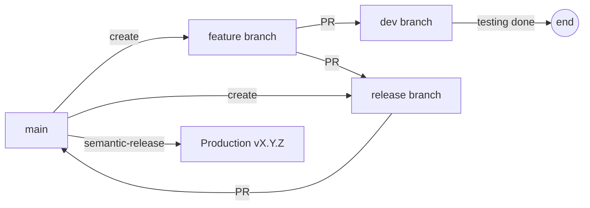
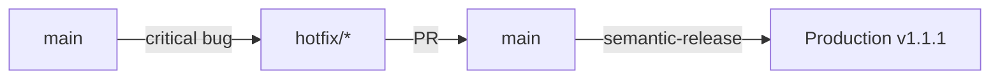

# Advanced Branching Strategy & Semantic Versioning Guide

## 📋 Table of Contents
1. [Overview](#overview)
2. [Branch Types](#branch-types)
3. [Workflow Diagrams](#workflow-diagrams)
4. [Version Format](#version-format)
5. [Commit Convention](#commit-convention)
6. [GitHub Actions Workflows](#github-actions-workflows)
7. [Implementation Guide](#implementation-guide)
8. [Testing Scenarios](#testing-scenarios)

---

## Overview

This document outlines the comprehensive branching strategy with semantic versioning for production-grade software development, including QA processes and release management.

### Key Principles
- **main**: Production-ready code only
- **dev**: Integration and testing environment (optional)
- **release/***: QA testing and release preparation
- **feature/***: Feature development
- **hotfix/***: Critical production fixes

### Dual-Path Feature Workflow
Features have two paths to production:
1. **Direct Path**: main → feature → release → main (for ready features)
2. **Dev Path**: main → feature → dev (for integration testing only)

---

## Branch Types

### 1. Main Branch (`main`)
- **Purpose**: Production code, stable releases only
- **Protection**: Required reviews, passing CI/CD, no direct commits
- **Merges from**: `release/*` and `hotfix/*` only
- **Version updates**: Automatic via semantic-release

### 2. Development Branch (`dev`)
- **Purpose**: Integration testing, feature validation
- **Created from**: `main`
- **Merges from**: `feature/*` branches
- **Testing**: Automated integration tests, development validation

### 3. Feature Branches (`feature/*`)
- **Pattern**: `feature/[ticket-id]-[description]`
- **Created from**: `main`
- **Workflow**: 
  - Option 1: main → feature → dev (for development testing)
  - Option 2: main → feature → release → main (for production release)
- **Example**: `feature/JIRA-123-user-authentication`

### 4. Release Branches (`release/[date]-[description]`)
- **Pattern**: `release/DDMMYY-description`
- **Created from**: `main`
- **Purpose**: QA testing, release preparation
- **Pre-release versions**: `X.Y.Z-rc.DDMMYY`
- **Date format**: DDMMYY (day-month-year with 2-digit year)
- **Examples**: 
  - `release/120125-payment-gateway`
  - `release/150125-user-dashboard`
  - `release/200125-api-v2`

### 5. Hotfix Branches (`hotfix/*`)
- **Pattern**: `hotfix/[issue]-[description]`
- **Created from**: `main`
- **Workflow**: main → hotfix → main (bypasses dev/release)
- **Example**: `hotfix/critical-auth-bug`

---

## Workflow Diagrams

### Standard Feature Development Flow


### Hotfix Flow


---

## Version Format

### Standard Format
```
MAJOR.MINOR.PATCH[-PRERELEASE]
```

### Examples
- **Stable Release**: `1.2.3`
- **Release Candidate**: `1.2.3-rc.120125` (for release/120125-feature)
- **Beta Version**: `2.0.0-beta.3`
- **Hotfix Pre-release**: `1.2.4-hotfix.1`

### Version Progression
```
1.0.0 → 1.1.0-rc.120125 → 1.1.0 → 1.1.1-hotfix.1 → 1.1.1
```

---

## Commit Convention

### Commit-to-Version Mapping

| Commit Type | Version Bump | Example |
|-------------|--------------|---------|
| `fix:` | Patch (0.0.X) | `fix: resolve memory leak` |
| `feat:` | Minor (0.X.0) | `feat: add user profiles` |
| `feat!:` or `BREAKING CHANGE` | Major (X.0.0) | `feat!: new auth system` |
| `perf:` | Patch (0.0.X) | `perf: optimize queries` |
| `refactor:` | Patch (0.0.X) | `refactor: simplify logic` |
| `chore:`, `docs:`, `style:` | No version | `chore: update deps` |

### Commit Message Structure
```
<type>[optional scope]: <description>

[optional body]

[optional footer(s)]
```

### Examples
```bash
# Feature commit
git commit -m "feat: implement user authentication

- Add JWT token support
- Implement refresh token mechanism
- Add session management

Closes #123"

# Breaking change
git commit -m "feat!: migrate to OAuth 2.0

BREAKING CHANGE: Old authentication tokens are no longer valid"

# Fix commit
git commit -m "fix: resolve database connection timeout

Increased connection pool size and added retry logic"
```

---

## GitHub Actions Workflows

### 1. Release Preparation (`release-preparation.yml`)

**Trigger**: When feature branches merge into release branches

**Actions**:
- Generate pre-release version (e.g., `1.2.0-rc.20250911`)
- Update CHANGELOG.md with draft entries
- Create RELEASE_NOTES.md for QA
- Update package.json with pre-release version

**Configuration**: See `.github/workflows/release-preparation.yml`

### 2. Semantic Release (`semantic-release.yml`)

**Trigger**: When release branches merge into main

**Actions**:
- Remove pre-release suffix
- Apply semantic versioning rules
- Generate final CHANGELOG.md
- Create GitHub release
- Tag repository with version

**Configuration**: See `.github/workflows/semantic-release.yml`

---

## Implementation Guide

### Step 1: Create Development Branch
```bash
# One-time setup
git checkout main
git checkout -b dev
git push -u origin dev

# Protect dev branch in GitHub settings
```

### Step 2: Feature Development
```bash
# Create feature from main
git checkout main
git pull origin main
git checkout -b feature/JIRA-123-user-auth

# Make changes
git add .
git commit -m "feat: implement user authentication"
git push -u origin feature/JIRA-123-user-auth

# Create PR to dev
gh pr create --base dev --title "feat: user authentication" --body "Implements JWT auth"
```

### Step 3: Create Release Branch
```bash
# Create release branch from main with date and description
RELEASE_DATE=$(date +%d%m%y)  # Format: DDMMYY
RELEASE_DESC="payment-gateway"  # Short description
git checkout main
git checkout -b release/$RELEASE_DATE-$RELEASE_DESC
git push -u origin release/$RELEASE_DATE-$RELEASE_DESC

# Option A: Merge features directly from feature branches
# Feature branches can PR directly to release branch

# Option B: Merge tested features from dev (if used)
# git merge dev

# This triggers release-preparation.yml
```

### Step 4: QA Testing
```bash
# QA tests on release branch
# Fix any issues directly on release branch
git commit -m "fix: resolve QA finding #1"
git push
```

### Step 5: Release to Production
```bash
# After QA approval
gh pr create --base main --title "Release $RELEASE_DATE-$RELEASE_DESC" --body "QA approved release"

# Merge triggers semantic-release.yml
gh pr merge --merge
```

### Step 6: Hotfix Process
```bash
# For critical production issues
git checkout main
git checkout -b hotfix/critical-auth-bug

# Fix issue
git commit -m "fix: resolve authentication bypass vulnerability"
git push -u origin hotfix/critical-auth-bug

# Direct PR to main
gh pr create --base main --title "Hotfix: Critical auth bug" --body "Fixes CVE-2025-001"
gh pr merge --merge
```

---

## Testing Scenarios

### Scenario 1: Standard Feature Release (Direct to Release)
```bash
# Create feature from main
git checkout main
git checkout -b feature/new-dashboard
echo "// Dashboard code" > src/dashboard.js
git add . && git commit -m "feat: add dashboard module"
git push -u origin feature/new-dashboard

# Create release branch
TIMESTAMP=$(date +%Y%m%d)
git checkout main
git checkout -b release/v$TIMESTAMP
git push -u origin release/v$TIMESTAMP

# PR feature directly to release branch
gh pr create --base release/v$TIMESTAMP --head feature/new-dashboard --title "feat: dashboard" --body "New dashboard"
gh pr merge

# After QA approval on release branch, merge to main
gh pr create --base main --head release/v$TIMESTAMP --title "Release v$TIMESTAMP" --body "Release dashboard feature"
gh pr merge
```

### Scenario 1b: Feature Release via Dev Branch
```bash
# Create feature
git checkout main
git checkout -b feature/new-dashboard
echo "// Dashboard code" > src/dashboard.js
git add . && git commit -m "feat: add dashboard module"
git push -u origin feature/new-dashboard

# PR to dev for integration testing
gh pr create --base dev --title "feat: dashboard" --body "New dashboard"
gh pr merge

# Development testing complete, ready for release
# (Features can later be merged from dev or directly to release branch)
```

### Scenario 2: Hotfix Deployment
```bash
# Create hotfix from main
git checkout main
git checkout -b hotfix/security-patch

# Apply fix
echo "// Security fix" > src/security-patch.js
git add . && git commit -m "fix: patch SQL injection vulnerability"
git push -u origin hotfix/security-patch

# Direct to main
gh pr create --base main --title "Hotfix: SQL injection" --body "Critical security fix"
gh pr merge
```

### Scenario 3: Multiple Features in Release
```bash
# Feature 1
git checkout -b feature/user-profiles
git commit -m "feat: add user profiles"
gh pr create --base dev && gh pr merge

# Feature 2
git checkout -b feature/notifications
git commit -m "feat: add push notifications"
gh pr create --base dev && gh pr merge

# Create release with both features
TIMESTAMP=$(date +%Y%m%d)
git checkout -b release/v$TIMESTAMP
git merge dev
git push -u origin release/v$TIMESTAMP

# QA testing phase...
# Then merge to main for production release
```

---

## Configuration Files

### `.releaserc.json`
```json
{
  "branches": [
    "main",
    {
      "name": "release/*",
      "prerelease": "rc"
    },
    {
      "name": "hotfix/*",
      "prerelease": "hotfix"
    }
  ],
  "plugins": [
    "@semantic-release/commit-analyzer",
    "@semantic-release/release-notes-generator",
    "@semantic-release/changelog",
    "@semantic-release/npm",
    "@semantic-release/github",
    "@semantic-release/git"
  ]
}
```

### Branch Protection Rules

#### Main Branch
- Require pull request reviews (2 approvals)
- Dismiss stale PR approvals
- Require status checks (CI/CD)
- Require branches to be up to date
- Include administrators
- Restrict who can push

#### Dev Branch
- Require pull request reviews (1 approval)
- Require status checks (tests)
- Require branches to be up to date

#### Release Branches
- Require pull request reviews (1 approval)
- Require QA approval label
- Require status checks

---

## Best Practices

### 1. Commit Messages
- Use conventional commits strictly
- Include ticket references
- Provide meaningful descriptions

### 2. Branch Naming
- Use consistent patterns
- Include ticket/issue IDs
- Keep names descriptive but concise

### 3. Release Management
- Always test in dev before release
- Document all changes in CHANGELOG
- Tag releases appropriately
- Keep release branches short-lived

### 4. Hotfix Protocol
- Use only for critical production issues
- Test thoroughly despite urgency
- Document the issue and fix
- Backport to dev after deployment

---

## Troubleshooting

### Issue: Version conflicts
**Solution**: Always pull latest main before creating branches

### Issue: Pre-release not converting
**Solution**: Check that release branch follows pattern `release/v*`

### Issue: Semantic-release not triggering
**Solution**: Verify PR is from release/* or hotfix/* branch

### Issue: Duplicate version tags
**Solution**: Ensure only one workflow creates tags (semantic-release.yml)

---

## Summary

This branching strategy provides:
- ✅ Clear separation of concerns
- ✅ QA testing phase via release branches
- ✅ Automated versioning
- ✅ Hotfix capability for emergencies
- ✅ Complete audit trail
- ✅ Pre-release versions for testing
- ✅ Production stability

For questions or modifications, consult with the DevOps team.