# Branching Strategy, Versioning & CI/CD Guide

> **Version**: 2.0.0  
> **Last Updated**: 2024  
> **Status**: Production Ready

## 📋 Table of Contents

1. [Overview](#overview)
2. [Branching Strategy](#branching-strategy)
3. [Versioning with Semantic Release](#versioning-with-semantic-release)
4. [CI/CD Workflows](#cicd-workflows)
5. [Commit Convention](#commit-convention)
6. [Deployment Strategy](#deployment-strategy)
7. [Rollback Procedures](#rollback-procedures)
8. [Best Practices](#best-practices)
9. [Quick Reference](#quick-reference)

---

## Overview

This document defines the authoritative branching strategy, versioning approach, and CI/CD pipeline for our projects. We use a modified GitFlow strategy with semantic versioning automation.

### Key Principles
- 🚀 **Automated Versioning** - No manual version bumps
- 🔒 **Protected Branches** - Enforce quality gates
- 📊 **Traceable Releases** - Complete audit trail
- ♻️ **Reproducible Builds** - Immutable artifacts
- 🎯 **Clear Ownership** - Defined responsibilities

---

## Branching Strategy

### Permanent Branches

#### `main`
- **Purpose**: Production-ready code only
- **Protection**: Required reviews, passing tests, up-to-date
- **Merges from**: `release/*` branches only
- **Deploys to**: Production environment

#### `dev`
- **Purpose**: Integration and developer testing
- **Protection**: Required reviews, passing tests
- **Merges from**: `feature/*` branches
- **Deploys to**: Development environment

### Temporary Branches

#### `feature/*`
- **Purpose**: New features, bug fixes, improvements
- **Created from**: `main` (ensures clean base)
- **Naming**: `feature/[ticket-id]-description`
- **Merges to**: `dev` first, then `release/*` when ready

#### `release/*`
- **Purpose**: QA testing and release preparation
- **Created from**: `main`
- **Naming**: `release/vX.Y.Z-rc.N`
- **Merges to**: `main` when QA approved

#### `hotfix/*`
- **Purpose**: Critical production fixes
- **Created from**: `main`
- **Naming**: `hotfix/[ticket-id]-description`
- **Merges to**: `main` directly, then back to `dev`

### Visual Flow


### Merge Strategy Decision Tree

```mermaid
graph TD
    Start[Ready to merge?] --> Type{Branch type?}
    Type -->|Feature| Dev[Merge to dev]
    Type -->|Hotfix| Main[Merge to main]
    Type -->|Release| QA{QA Approved?}
    
    Dev --> Test{Tests pass?}
    Test -->|Yes| DevDone[✓ In dev]
    Test -->|No| Fix[Fix issues]
    
    QA -->|Yes| ProdReady[Merge to main]
    QA -->|No| RCFix[Fix in release]
    
    ProdReady --> Prod[✓ In production]
    Main --> Emergency[✓ Hotfix deployed]
```



---

## Versioning with Semantic Release

### Automatic Version Determination

We use [semantic-release](https://semantic-release.gitbook.io/) to automatically:
- 📈 Determine next version from commits
- 📝 Generate changelogs
- 🏷️ Create GitHub releases
- 📦 Tag artifacts

### Version Format

```
MAJOR.MINOR.PATCH[-PRERELEASE]

Examples:
- 1.2.3 (stable release)
- 1.2.3-rc.1 (release candidate)
- 2.0.0-beta.3 (beta version)
```

### Commit-to-Version Mapping

| Commit Type | Version Bump | Example |
|------------|--------------|---------|
| `fix:` | Patch (0.0.X) | `fix: resolve memory leak` |
| `feat:` | Minor (0.X.0) | `feat: add user profiles` |
| `feat!:` or BREAKING CHANGE | Major (X.0.0) | `feat!: new auth system` |
| `chore:`, `docs:`, `style:` | No version | `chore: update deps` |
| `perf:` | Patch (0.0.X) | `perf: optimize queries` |
| `refactor:` | Patch (0.0.X) | `refactor: simplify logic` |

---

## CI/CD Workflows

### Workflow Architecture

```yaml
Feature Branch → feature-validation.yml → Dev Branch
Dev Branch → dev-integration.yml → Testing
Release Creation → release-preparation.yml → QA
Release Approval → semantic-release.yml → Production
```

### 1. Feature Validation (`feature-validation.yml`)

**Triggers**: PR from `feature/*` to `dev`

**Jobs**:
- 🔍 Linting (ESLint, Prettier)
- 🧪 Unit tests
- 📊 Code coverage check (>80%)
- 🏗️ Build verification

### 2. Dev Integration (`dev-integration.yml`)

**Triggers**: Push to `dev`

**Jobs**:
- 🔄 Integration tests
- 📈 Performance benchmarks
- 🚀 Preview deployment
- 📊 Commit analysis

### 3. Release Preparation (`release-preparation.yml`)

**Triggers**: Manual workflow dispatch

**Jobs**:
- 🏷️ Create release branch
- 📋 Generate pre-release version
- 📝 Update changelog draft
- 🎯 Deploy to QA environment

### 4. Semantic Release (`semantic-release.yml`)

**Triggers**: Push to `main` or merged PR

**Jobs**:
- ✅ Final validation suite
- 🎁 Semantic versioning
- 📝 Changelog generation
- 🏷️ GitHub release creation
- 🚀 Production deployment
- 🔄 Dev branch sync
- 🗑️ Release branch cleanup

---

## Commit Convention

### Format

```
<type>(<scope>): <subject>

[body]

[footer]
```

### Examples

```bash
# Feature
feat(auth): implement OAuth2 integration

# Bug fix
fix(api): handle null response in user endpoint

# Breaking change
feat(database)!: migrate from MongoDB to PostgreSQL

BREAKING CHANGE: Database migration required

# Performance
perf(search): optimize full-text search queries

# Documentation
docs(readme): add installation instructions
```

### Commit Types Reference

| Type | Description | Version Impact |
|------|-------------|----------------|
| `feat` | New feature | Minor |
| `fix` | Bug fix | Patch |
| `docs` | Documentation | None |
| `style` | Formatting | None |
| `refactor` | Code restructuring | Patch |
| `perf` | Performance | Patch |
| `test` | Testing | None |
| `chore` | Maintenance | None |
| `revert` | Revert commit | Patch |

---

## Deployment Strategy

### Environment Progression

```
Local → Dev → QA → Staging → Production
```

### Deployment Tags

#### Docker Images (when applicable)
```bash
# Development
myapp:dev-latest
myapp:sha-abc123

# QA/Release Candidates  
myapp:v1.2.3-rc.1
myapp:sha-def456

# Production
myapp:v1.2.3
myapp:latest
myapp:sha-def456  # Same SHA as QA
```

### Deployment Verification

```mermaid
graph LR
    Deploy[Deploy] --> Health[Health Check]
    Health --> Smoke[Smoke Tests]
    Smoke --> Monitor[Monitor 5min]
    Monitor --> Success{All Green?}
    Success -->|Yes| Complete[✓ Complete]
    Success -->|No| Rollback[↺ Rollback]
```



---

## Rollback Procedures

### Automated Rollback Triggers

- ❌ Health check failures (3 consecutive)
- 📈 Error rate spike (>5% in 2 minutes)
- ⚡ Response time degradation (>2x baseline)
- 💾 Memory/CPU threshold breach (>90%)

### Manual Rollback Process

#### 1. Quick Rollback (< 5 minutes)
```bash
# Revert to previous version
git revert HEAD --no-edit
git push origin main

# Trigger immediate deployment
gh workflow run deploy.yml --ref main
```

#### 2. Version-Specific Rollback
```bash
# Find target version
git tag -l "v*" | tail -10

# Create rollback branch
git checkout -b rollback/v1.2.2 v1.2.2
git push origin rollback/v1.2.2

# Deploy specific version
gh workflow run deploy.yml --ref rollback/v1.2.2 -f version=v1.2.2
```

### Rollback Communication

1. **Immediate**: Alert in #incidents Slack channel
2. **Within 5 min**: Update status page
3. **Within 30 min**: Root cause analysis started
4. **Within 2 hours**: Incident report draft
5. **Within 24 hours**: Post-mortem meeting

---

## Best Practices

### Branch Management

✅ **DO**
- Create feature branches from `main`
- Keep branches small and focused
- Delete branches after merge
- Rebase feature branches regularly

❌ **DON'T**
- Work directly on `main` or `dev`
- Create long-lived feature branches
- Merge without reviews
- Skip tests to "save time"

### Commit Guidelines

✅ **DO**
- Write clear, descriptive messages
- Use conventional commit format
- Reference issue numbers
- Commit frequently

❌ **DON'T**
- Use generic messages ("fix", "update")
- Mix features in one commit
- Commit sensitive data
- Amend published commits

### Release Management

✅ **DO**
- Test thoroughly in QA
- Document breaking changes
- Communicate release schedules
- Monitor post-release metrics

❌ **DON'T**
- Skip QA for "small" changes
- Release on Fridays
- Ignore rollback procedures
- Deploy without backups

---

## Quick Reference

### Common Commands

```bash
# Start new feature
git checkout main && git pull
git checkout -b feature/JIRA-123-add-search

# Submit for review
git push origin feature/JIRA-123-add-search
# Create PR via GitHub UI → dev

# Create release (via GitHub Actions)
# Go to Actions → Release Preparation → Run workflow

# Emergency hotfix
git checkout main && git pull
git checkout -b hotfix/JIRA-456-critical-bug
# Fix issue
git commit -m "fix: resolve critical payment bug"
git push origin hotfix/JIRA-456-critical-bug
# Create PR → main (bypass release branch)

# Check release status
gh release list --limit 5
gh workflow view "Semantic Release"
```

### Workflow Status Badges

```markdown


```

### Environment URLs

| Environment | URL | Branch |
|------------|-----|---------|
| Production | https://app.example.com | `main` |
| QA | https://qa.app.example.com | `release/*` |
| Dev | https://dev.app.example.com | `dev` |

---

## Troubleshooting

### Common Issues

#### "No release created"
**Cause**: No conventional commits  
**Fix**: Ensure commits follow format

#### "Release branch conflicts"
**Cause**: Outdated release branch  
**Fix**: Rebase on main before merge

#### "Tests fail in CI but pass locally"
**Cause**: Environment differences  
**Fix**: Check Node version, env vars

#### "Deployment rollback failed"
**Cause**: Database migration  
**Fix**: Run reverse migration first

---

## Responsibilities Matrix

| Role | Responsibilities |
|------|-----------------|
| **Developers** | Create features, write tests, conventional commits |
| **Tech Lead** | Review PRs, approve releases, architecture decisions |
| **QA Team** | Test release branches, approve for production |
| **DevOps** | Maintain CI/CD, monitor deployments, handle incidents |
| **Product Owner** | Prioritize features, approve releases, communicate |

---

## Appendix

### Configuration Files

- `.releaserc.json` - Semantic release config
- `.github/workflows/` - GitHub Actions
- `commitlint.config.js` - Commit linting
- `.github/CODEOWNERS` - Review assignments
- `.github/branch-protection.json` - Branch rules

### References

- [Semantic Release Documentation](https://semantic-release.gitbook.io/)
- [Conventional Commits](https://www.conventionalcommits.org/)
- [GitHub Actions](https://docs.github.com/en/actions)
- [GitFlow](https://nvie.com/posts/a-successful-git-branching-model/)

---

*This strategy ensures consistent, reliable, and traceable software delivery while maintaining high quality standards.*