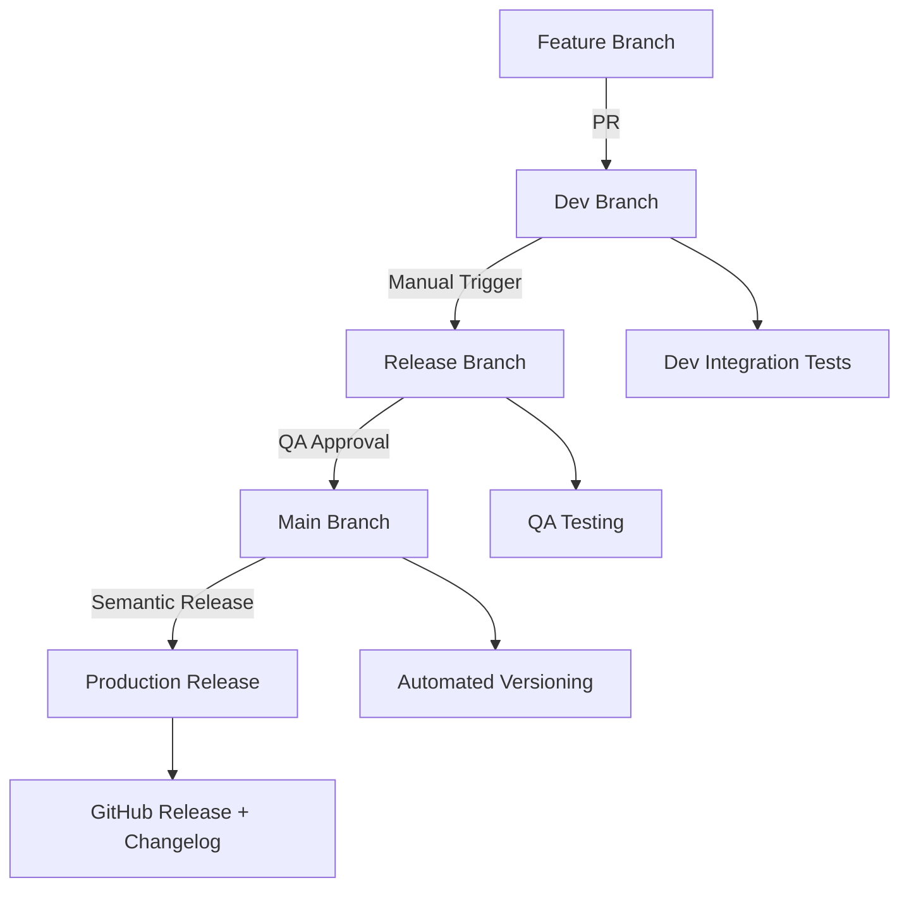

# Sample Semantic Release Project

[](https://github.com/semantic-release/semantic-release)
[](https://github.com/username/sample-semantic-release/actions)
[](https://codecov.io/gh/username/sample-semantic-release)
[](https://opensource.org/licenses/MIT)

A complete reference implementation demonstrating **semantic versioning**, **automated changelog generation**, and **branching strategy** using GitHub Actions, semantic-release, and conventional commits.

## 🎯 Purpose

This project provides a production-ready template for implementing:

- ✅ **Automated semantic versioning** based on conventional commits
- ✅ **Automated changelog generation** and GitHub releases
- ✅ **Robust branching strategy** (main, dev, feature/, release/)
- ✅ **Comprehensive CI/CD workflows** with GitHub Actions
- ✅ **Code quality enforcement** with linting, testing, and formatting
- ✅ **Branch protection rules** for code quality gates

Perfect for teams wanting to implement GitFlow-style development with automated versioning and releases.

## 📋 Table of Contents

- [Quick Start](#-quick-start)
- [Architecture Overview](#-architecture-overview)
- [Branching Strategy](#-branching-strategy)  
- [Conventional Commits](#-conventional-commits)
- [GitHub Actions Workflows](#-github-actions-workflows)
- [Local Development](#-local-development)
- [API Documentation](#-api-documentation)
- [Release Process](#-release-process)
- [Configuration](#-configuration)
- [Troubleshooting](#-troubleshooting)

## 🚀 Quick Start

### Prerequisites

- **Node.js**: >= 18.0.0
- **npm**: >= 8.0.0
- **Git**: Latest version
- **GitHub account** with repository access

### 1. Clone and Setup

```bash
# Clone the repository
git clone https://github.com/username/sample-semantic-release.git
cd sample-semantic-release

# Install dependencies
npm install

# Start the application
npm start
```

The application will start on [http://localhost:3000](http://localhost:3000)

### 2. Verify Installation

```bash
# Run tests
npm test

# Run linting
npm run lint

# Check formatting
npm run format:check

# View application info
curl http://localhost:3000
```

### 3. First Feature Development

```bash
# Create feature branch from main
git checkout main
git pull origin main
git checkout -b feature/my-first-feature

# Make your changes
# ...

# Commit using conventional format
git add .
git commit -m "feat: add my awesome feature"

# Push and create PR to dev
git push origin feature/my-first-feature
```

## 🏗️ Architecture Overview

### Branching Strategy

```
main (production)
├── release/v1.2.0 (QA testing)
│   └── dev (integration)
│       ├── feature/user-auth
│       ├── feature/dashboard  
│       └── feature/api-v2
```

- **main**: Production releases with semantic versioning
- **dev**: Development integration and testing
- **feature/**: Feature development (created from main)
- **release/**: QA testing with pre-release versions

### CI/CD Pipeline



## 🌿 Branching Strategy

### Feature Development Workflow

1. **Create feature branch from main**:
   ```bash
   git checkout main
   git pull origin main
   git checkout -b feature/feature-name
   ```

2. **Develop and commit** with conventional format:
   ```bash
   git add .
   git commit -m "feat: add new functionality"
   ```

3. **Create PR to dev branch**:
   - Feature validation runs automatically
   - Requires code review approval
   - All tests must pass

4. **Merge to dev** triggers integration tests

### Release Management Workflow

1. **Prepare release** from dev branch:
   ```bash
   # Manual trigger via GitHub Actions UI
   # Creates release/vX.Y.Z-rc.1 branch
   ```

2. **QA testing** on release branch:
   - Functional testing
   - Performance validation
   - Security checks

3. **Merge to main** for production:
   - Semantic release runs automatically
   - Version bump based on conventional commits
   - Changelog generation
   - GitHub release creation

### Branch Protection

Each branch has specific protection rules:

- **main**: Requires PR review, all status checks, admin-only pushes
- **dev**: Requires PR review, feature validation checks  
- **release/**: Requires PR review, QA approval

See [Branch Protection Configuration](.github/branch-protection-config.md) for detailed setup.

## 📝 Conventional Commits

This project uses [Conventional Commits](https://conventionalcommits.org/) for automated versioning.

### Commit Format

```
<type>[optional scope]: <description>

[optional body]

[optional footer(s)]
```

### Commit Types

| Type | Description | Version Bump |
|------|-------------|--------------|
| `feat` | New feature | Minor (1.1.0) |
| `fix` | Bug fix | Patch (1.0.1) |
| `perf` | Performance improvement | Patch (1.0.1) |
| `docs` | Documentation only | None |
| `style` | Code style changes | None |
| `refactor` | Code refactoring | Patch (1.0.1) |
| `test` | Adding tests | None |
| `chore` | Build/tool changes | None |

### Breaking Changes

For major version bumps, use:

```bash
# Method 1: Add ! after type
git commit -m "feat!: change API response format"

# Method 2: Add BREAKING CHANGE in footer
git commit -m "feat: new API endpoint

BREAKING CHANGE: old API endpoint removed"
```

### Examples

```bash
# New feature (minor version bump)
git commit -m "feat: add user profile management"

# Bug fix (patch version bump)  
git commit -m "fix: resolve memory leak in data processing"

# Breaking change (major version bump)
git commit -m "feat!: change authentication method"

# Scoped commits
git commit -m "feat(auth): add OAuth2 integration"
git commit -m "fix(api): handle edge case in user validation"
```

## ⚙️ GitHub Actions Workflows

### 1. Feature Validation (`feature-validation.yml`)

**Triggers**: PRs from `feature/*` to `dev`

**Jobs**:
- 🔍 **Lint & Code Quality**: Super-Linter, ESLint, Prettier
- 🏗️ **Build & Test**: Multi-Node.js versions, coverage reports
- 💬 **Commit Validation**: Conventional commit format
- 🛡️ **Security Scan**: npm audit, CodeQL analysis

### 2. Dev Integration (`dev-integration.yml`)

**Triggers**: Pushes to `dev` branch

**Jobs**:
- 🔄 **Integration Tests**: Full test suite, health checks
- 🔍 **Pre-release Validation**: Releasable commit analysis
- 📈 **Quality Metrics**: Code quality, performance analysis

### 3. Release Preparation (`release-preparation.yml`)

**Triggers**: Manual workflow dispatch

**Jobs**:
- ✅ **Source Validation**: Branch status, commit analysis
- 🌿 **Release Branch Creation**: Automated branch creation
- 📝 **QA Issue Creation**: Automated testing checklist

### 4. Semantic Release (`semantic-release.yml`)

**Triggers**: Pushes/PRs to `main` branch

**Jobs**:
- ✅ **Pre-release Validation**: Final testing, security scans
- 🎁 **Semantic Release**: Automated versioning, changelog
- 📬 **Post-release**: Branch cleanup, notifications

## 💻 Local Development

### Development Setup

```bash
# Install dependencies
npm install

# Start development server with auto-restart
npm start

# Run tests in watch mode  
npm run test:watch

# Run linting with auto-fix
npm run lint:fix

# Format code
npm run format
```

### Project Structure

```
sample-semrel/
├── .github/
│   ├── workflows/                 # GitHub Actions workflows
│   │   ├── feature-validation.yml
│   │   ├── dev-integration.yml
│   │   ├── release-preparation.yml
│   │   └── semantic-release.yml
│   └── branch-protection-config.md
├── src/
│   ├── index.js                   # Main application
│   ├── calculator.js              # Calculator utility
│   ├── userManager.js             # User management
│   └── logger.js                  # Logging utility
├── test/
│   ├── index.test.js              # API integration tests
│   ├── calculator.test.js         # Calculator unit tests
│   └── userManager.test.js        # User manager unit tests
├── package.json                   # Dependencies and scripts
├── .releaserc.json               # Semantic release config
├── commitlint.config.js          # Commit linting rules
├── .super-linter.yml             # Linter configuration
└── README.md                     # This file
```

### Available Scripts

```bash
npm start              # Start the application
npm test               # Run test suite
npm run test:watch     # Run tests in watch mode
npm run test:coverage  # Run tests with coverage
npm run lint           # Run ESLint
npm run lint:fix       # Run ESLint with auto-fix
npm run format         # Format code with Prettier
npm run format:check   # Check code formatting
```

### Environment Variables

```bash
# Application
PORT=3000                    # Server port (default: 3000)
NODE_ENV=development         # Environment (development/production)

# Logging
LOG_LEVEL=INFO              # Log level (ERROR/WARN/INFO/DEBUG)
EXTERNAL_LOGGING=false      # Enable external log services

# GitHub Actions (automatically set)
GITHUB_TOKEN=               # GitHub API token
GITHUB_SHA=                 # Commit SHA
GITHUB_RUN_NUMBER=          # Build number
```

## 📚 API Documentation

The sample application provides a RESTful API for demonstration purposes.

### Base URL

```
http://localhost:3000
```

### Endpoints

#### Application Info

```http
GET /
```

**Response**:
```json
{
  "name": "sample-semantic-release",
  "version": "1.0.0",
  "status": "running",
  "uptime": 3600,
  "message": "🎉 Welcome to the Sample Semantic Release Application!",
  "endpoints": {
    "health": "/health",
    "version": "/version", 
    "calculator": "/api/calculator",
    "users": "/api/users"
  }
}
```

#### Health Check

```http
GET /health
```

**Response**:
```json
{
  "status": "healthy",
  "timestamp": "2024-01-01T00:00:00.000Z",
  "uptime": 3600,
  "version": "1.0.0",
  "memory": {
    "rss": 50331648,
    "heapTotal": 20971520,
    "heapUsed": 15728640
  }
}
```

#### Version Information

```http
GET /version
```

**Response**:
```json
{
  "version": "1.0.0",
  "name": "sample-semantic-release",
  "gitCommit": "abc123def",
  "buildNumber": "42"
}
```

#### Calculator API

**Addition**:
```http
POST /api/calculator/add
Content-Type: application/json

{
  "a": 5,
  "b": 3
}
```

**Response**:
```json
{
  "operation": "addition",
  "inputs": { "a": 5, "b": 3 },
  "result": 8,
  "timestamp": "2024-01-01T00:00:00.000Z"
}
```

**Multiplication**:
```http
POST /api/calculator/multiply
Content-Type: application/json

{
  "a": 4,
  "b": 6
}
```

#### User Management API

**Get all users**:
```http
GET /api/users
```

**Create user**:
```http
POST /api/users
Content-Type: application/json

{
  "name": "John Doe",
  "email": "john@example.com"
}
```

**Get user by ID**:
```http
GET /api/users/:id
```

### Error Responses

All API endpoints return consistent error responses:

```json
{
  "error": "Error description",
  "timestamp": "2024-01-01T00:00:00.000Z"
}
```

HTTP Status Codes:
- `200` - Success
- `201` - Created
- `400` - Bad Request
- `404` - Not Found
- `409` - Conflict
- `500` - Internal Server Error

## 🎁 Release Process

### Automated Releases

Releases are fully automated based on conventional commits:

1. **Feature commits** (`feat:`) trigger **minor** version bump (1.1.0)
2. **Fix commits** (`fix:`, `perf:`) trigger **patch** version bump (1.0.1)  
3. **Breaking changes** (`feat!:`, `BREAKING CHANGE:`) trigger **major** version bump (2.0.0)

### Manual Release Process

For manual releases or hotfixes:

1. **Prepare release branch**:
   ```bash
   # Go to GitHub Actions → Release Preparation → Run workflow
   # Select source branch (usually 'dev')
   # Choose release type (auto/major/minor/patch)
   ```

2. **QA testing**:
   - Automated QA issue created
   - Test on release branch
   - Comment "APPROVED" when ready

3. **Merge to main**:
   ```bash
   # Create PR from release/vX.Y.Z-rc.1 to main
   # Semantic release runs automatically after merge
   ```

### Release Artifacts

Each release automatically creates:

- 📦 **Git tag** (e.g., `v1.2.0`)
- 📝 **GitHub release** with release notes
- 📋 **CHANGELOG.md** updates
- 📊 **Release metrics** and statistics

### Hotfix Process

For critical production fixes:

```bash
# Create hotfix branch from main
git checkout main
git pull origin main
git checkout -b release/hotfix-v1.2.1

# Make critical fix
git add .
git commit -m "fix: resolve critical security vulnerability"

# Push and create PR to main
git push origin release/hotfix-v1.2.1

# Semantic release handles versioning automatically
```

## ⚙️ Configuration

### Semantic Release Configuration

The `.releaserc.json` file controls semantic release behavior:

```json
{
  "branches": [
    "main",
    {
      "name": "release/*",
      "prerelease": "rc"
    }
  ],
  "plugins": [
    "@semantic-release/commit-analyzer",
    "@semantic-release/release-notes-generator", 
    "@semantic-release/changelog",
    "@semantic-release/npm",
    "@semantic-release/github",
    "@semantic-release/git"
  ]
}
```

### Commit Linting Configuration

The `commitlint.config.js` enforces conventional commit format:

```javascript
module.exports = {
  extends: ['@commitlint/config-conventional'],
  rules: {
    'type-enum': [2, 'always', [
      'feat', 'fix', 'docs', 'style', 'refactor', 
      'perf', 'test', 'chore', 'ci', 'build'
    ]],
    'subject-max-length': [2, 'always', 72]
  }
}
```

### Code Quality Configuration

**ESLint** (in `package.json`):
```json
{
  "eslintConfig": {
    "extends": ["eslint:recommended", "plugin:jest/recommended", "prettier"],
    "rules": {
      "no-console": "warn",
      "prefer-const": "error",
      "no-var": "error"
    }
  }
}
```

**Prettier** (in `package.json`):
```json
{
  "prettier": {
    "semi": true,
    "trailingComma": "es5", 
    "singleQuote": true,
    "printWidth": 100
  }
}
```

## 🔧 Troubleshooting

### Common Issues

#### Issue: Semantic release fails with "No release published"

**Cause**: No conventional commits since last release

**Solution**:
```bash
# Check recent commits
git log --oneline

# Ensure commits follow format
git commit --amend -m "feat: your feature description"
```

#### Issue: Feature validation fails on linting

**Cause**: Code doesn't meet linting standards

**Solution**:
```bash
# Fix linting issues locally
npm run lint:fix
npm run format

# Commit fixes
git add .
git commit -m "style: fix linting issues"
```

#### Issue: Tests failing in CI

**Cause**: Environment differences or missing dependencies

**Solution**:
```bash
# Run tests locally first
npm test

# Check for environment-specific issues
NODE_ENV=test npm test

# Update snapshots if needed
npm test -- --updateSnapshot
```

#### Issue: Branch protection blocking merge

**Cause**: Required status checks not passing

**Solution**:
1. Check which status checks are failing
2. Fix issues and push updates
3. Ensure branch is up to date with target
4. Wait for all checks to pass

#### Issue: Release branch creation fails

**Cause**: Source branch not ready or conflicts

**Solution**:
```bash
# Ensure source branch is clean
git checkout dev
git status

# Pull latest changes
git pull origin dev

# Check for pending commits
git log --oneline main..dev
```

### Debug Mode

Enable debug logging for troubleshooting:

```bash
# Start application with debug logging
LOG_LEVEL=DEBUG npm start

# Run semantic release with debug output
DEBUG=semantic-release:* npx semantic-release --dry-run
```

### Getting Help

1. **Check workflow logs** in GitHub Actions tab
2. **Review semantic release logs** for version calculation issues
3. **Validate commit messages** against conventional commit format
4. **Verify branch protection rules** match workflow requirements
5. **Test locally** before pushing to remote branches

### Contact and Support

- 📋 **Issues**: [GitHub Issues](https://github.com/username/sample-semantic-release/issues)
- 📚 **Documentation**: [Semantic Release Strategy](semantic-release-strategy.md)
- 🔧 **Configuration**: [Branch Protection Setup](.github/branch-protection-config.md)

## 📄 License

This project is licensed under the MIT License - see the [LICENSE](LICENSE) file for details.

## 🤝 Contributing

We welcome contributions! Please see our contribution guidelines:

1. **Fork** the repository
2. **Create** a feature branch: `git checkout -b feature/amazing-feature`
3. **Commit** your changes using conventional format
4. **Push** to the branch: `git push origin feature/amazing-feature`
5. **Open** a Pull Request to the `dev` branch

### Contribution Checklist

- [ ] Follows conventional commit format
- [ ] Includes appropriate tests
- [ ] Updates documentation if needed
- [ ] Passes all linting and formatting checks
- [ ] Includes clear description of changes

---

**🎉 Happy coding with automated semantic versioning!**

*This project demonstrates production-ready semantic versioning and release automation. Use it as a template for your own projects to achieve consistent, automated releases with proper branching strategy and code quality enforcement.*