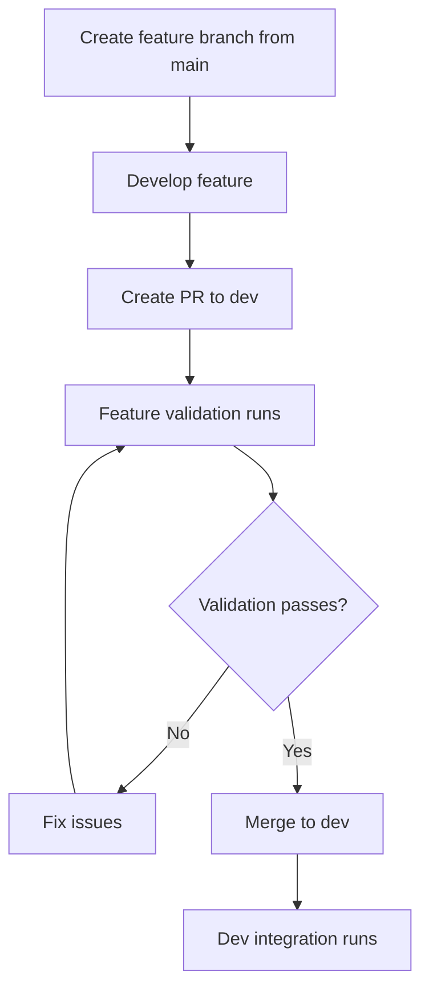
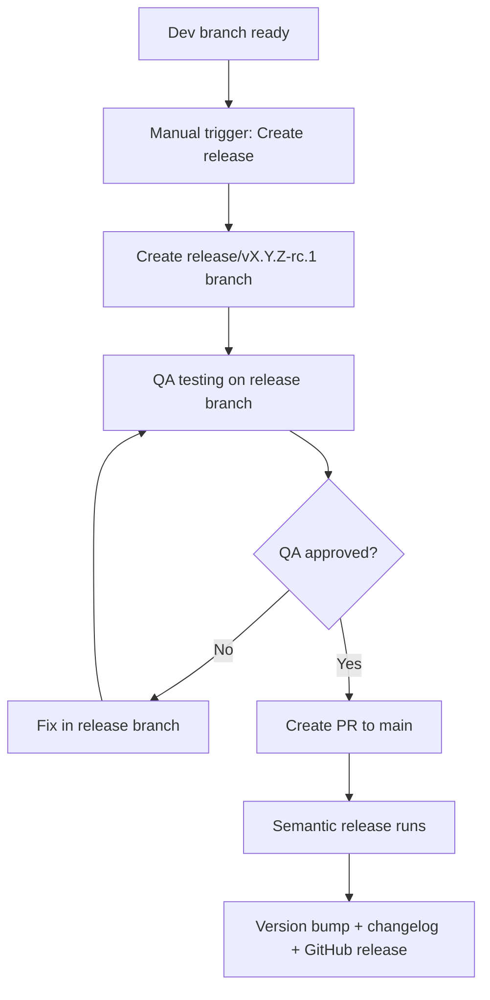

i# Semantic Versioning & Branching Strategy Design

## Refined Architecture Overview

**Focus:** Semantic versioning automation with streamlined branching strategy (no deployment configurations)

### Branching Strategy
- **main** → Production releases with semantic versioning
- **dev** → Development integration branch  
- **feature/** → Feature development (created from main)
- **release/** → QA testing with pre-release versions

### Simplified Workflow
```
feature/xyz (from main) → dev → release/v1.x.x-rc.1 → main (semantic release)
```

## Project Structure

```
sample-semrel/
├── .github/
│   ├── workflows/
│   │   ├── feature-validation.yml      # Lint + build for feature PRs
│   │   ├── dev-integration.yml         # Integration checks on dev
│   │   ├── release-preparation.yml     # Create/manage release branches
│   │   └── semantic-release.yml        # Main semantic versioning workflow
│   └── branch-protection-config.md     # Branch protection documentation
├── src/
│   └── index.js                        # Sample Node.js application
├── test/
│   └── index.test.js                   # Sample tests
├── package.json                        # With semantic-release config
├── .releaserc.json                     # Semantic release configuration
├── .super-linter.yml                   # Linter settings
├── README.md                           # Project documentation
└── commitlint.config.js               # Commit message linting
```

## Core GitHub Actions Workflows

### 1. Feature Validation (`feature-validation.yml`)
- **Trigger:** PRs from feature/* to dev
- **Actions:** Super-Linter + build checks + tests

### 2. Dev Integration (`dev-integration.yml`)
- **Trigger:** Pushes to dev branch
- **Actions:** Integration tests + pre-release validation

### 3. Release Preparation (`release-preparation.yml`)
- **Trigger:** Manual workflow dispatch from dev
- **Actions:** Create release branch with pre-release version

### 4. Semantic Release (`semantic-release.yml`)
- **Trigger:** PRs from release/* to main  
- **Actions:** Semantic versioning + changelog generation + GitHub release

## Key Features

- ✅ Automated semantic versioning based on conventional commits
- ✅ Automated changelog generation  
- ✅ Pre-release version management for QA
- ✅ Comprehensive linting and testing
- ✅ Branch protection with required status checks
- ✅ No deployment complexity - focus on versioning workflow

## Implementation Plan

1. Create Node.js sample project with basic structure
2. Configure semantic-release for custom branch strategy
3. Implement 4 focused GitHub Actions workflows
4. Set up commit message linting with conventional commits
5. Configure branch protection rules
6. Document complete workflow and usage

## Detailed Workflow Specifications

### Feature Development Workflow



### Release Management Workflow



## Conventional Commit Format

### Commit Message Structure
```
<type>[optional scope]: <description>

[optional body]

[optional footer(s)]
```

### Commit Types
- `feat:` - New feature (triggers minor version bump)
- `fix:` - Bug fix (triggers patch version bump)
- `docs:` - Documentation changes
- `style:` - Code style changes (formatting, etc.)
- `refactor:` - Code refactoring
- `perf:` - Performance improvements
- `test:` - Adding or updating tests
- `chore:` - Build process or auxiliary tool changes

### Breaking Changes
- Add `BREAKING CHANGE:` in footer or `!` after type (triggers major version bump)

### Examples
```
feat: add user authentication system
fix: resolve memory leak in data processing
docs: update API documentation
feat!: change authentication method (BREAKING CHANGE)
```

## Branch Protection Rules

### Main Branch Protection
- ✅ Require pull request reviews (minimum 1)
- ✅ Dismiss stale PR approvals when new commits are pushed
- ✅ Require status checks to pass before merging
  - ✅ semantic-release workflow
  - ✅ All tests pass
- ✅ Require branches to be up to date before merging
- ✅ Restrict pushes to administrators only

### Dev Branch Protection  
- ✅ Require pull request reviews (minimum 1)
- ✅ Require status checks to pass before merging
  - ✅ feature-validation workflow
  - ✅ All tests pass
- ✅ Require branches to be up to date before merging

### Release Branch Protection
- ✅ Require pull request reviews (minimum 1) 
- ✅ Require status checks to pass before merging
- ✅ Allow only specific users to merge to main

## Configuration Files

### `.releaserc.json` - Semantic Release Configuration
```json
{
  "branches": [
    "main",
    {
      "name": "release/*",
      "prerelease": "rc"
    }
  ],
  "plugins": [
    "@semantic-release/commit-analyzer",
    "@semantic-release/release-notes-generator",
    "@semantic-release/changelog",
    "@semantic-release/npm",
    "@semantic-release/github",
    [
      "@semantic-release/git",
      {
        "assets": ["CHANGELOG.md", "package.json"],
        "message": "chore(release): ${nextRelease.version} [skip ci]\n\n${nextRelease.notes}"
      }
    ]
  ]
}
```

### `commitlint.config.js` - Commit Message Linting
```javascript
module.exports = {
  extends: ['@commitlint/config-conventional'],
  rules: {
    'type-enum': [
      2,
      'always',
      [
        'feat',
        'fix',
        'docs',
        'style',
        'refactor',
        'perf',
        'test',
        'chore',
        'revert'
      ]
    ],
    'subject-max-length': [2, 'always', 72],
    'body-max-line-length': [2, 'always', 100]
  }
};
```

### `.super-linter.yml` - Linter Configuration
```yaml
---
DEFAULT_BRANCH: main
VALIDATE_ALL_CODEBASE: false
VALIDATE_JAVASCRIPT_ES: true
VALIDATE_TYPESCRIPT_ES: true
VALIDATE_JSON: true
VALIDATE_YAML: true
VALIDATE_MARKDOWN: true
DISABLE_ERRORS: false
```

## Usage Examples

### Starting a New Feature
```bash
# Create feature branch from main
git checkout main
git pull origin main
git checkout -b feature/user-profile

# Make changes and commit with conventional format
git add .
git commit -m "feat: add user profile management"

# Push and create PR to dev
git push origin feature/user-profile
# Create PR via GitHub UI: feature/user-profile → dev
```

### Preparing a Release
```bash
# Ensure dev branch is ready
git checkout dev
git pull origin dev

# Trigger release preparation via GitHub Actions UI
# This creates release/vX.Y.Z-rc.1 branch

# After QA approval, create PR: release/vX.Y.Z-rc.1 → main
# Semantic release will automatically:
# 1. Analyze commits since last release
# 2. Determine version bump (major/minor/patch)
# 3. Generate changelog
# 4. Create GitHub release
# 5. Update package.json version
```

### Hotfix Process
```bash
# Create hotfix branch from main
git checkout main
git pull origin main
git checkout -b release/hotfix-v1.2.1

# Make critical fix
git add .
git commit -m "fix: resolve critical security vulnerability"

# Push and create PR to main
git push origin release/hotfix-v1.2.1
# Create PR: release/hotfix-v1.2.1 → main
# Semantic release handles versioning automatically
```

## Troubleshooting Guide

### Common Issues

**Issue:** Semantic release fails with "No release published"
- **Cause:** No conventional commits since last release
- **Solution:** Ensure commits follow conventional format

**Issue:** Feature validation fails on linting
- **Cause:** Code doesn't meet linting standards
- **Solution:** Run `npm run lint:fix` locally before pushing

**Issue:** Release branch creation fails
- **Cause:** Dev branch not up to date or conflicts
- **Solution:** Ensure dev branch is clean and up to date

**Issue:** Version bump is incorrect
- **Cause:** Incorrect conventional commit format
- **Solution:** Review commit messages, use appropriate prefixes

### Best Practices

1. **Always create feature branches from main** - Ensures clean merge path
2. **Use descriptive commit messages** - Helps generate meaningful changelogs
3. **Test locally before pushing** - Reduces CI/CD failures
4. **Keep PRs focused** - Single feature/fix per PR
5. **Review release notes before publishing** - Ensure quality and accuracy

## Monitoring and Metrics

### Key Metrics to Track
- Time from feature start to production release
- Number of hotfixes required
- Release frequency
- Failed CI/CD runs ratio
- Code quality scores from Super-Linter

### GitHub Insights
- Monitor branch protection rule compliance
- Track PR review times
- Analyze commit message quality
- Review semantic release success rates

---

*This strategy provides a robust, automated approach to semantic versioning while maintaining code quality and release reliability.*